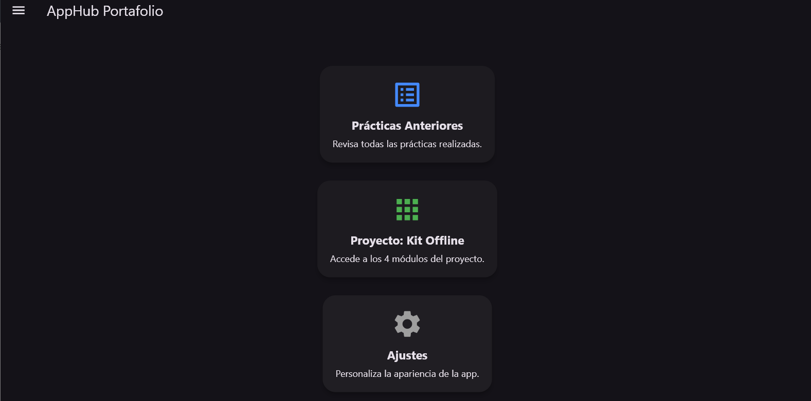
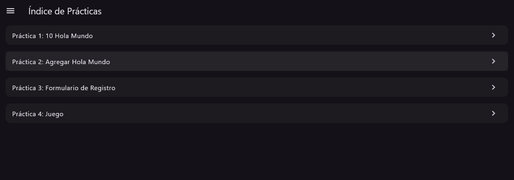
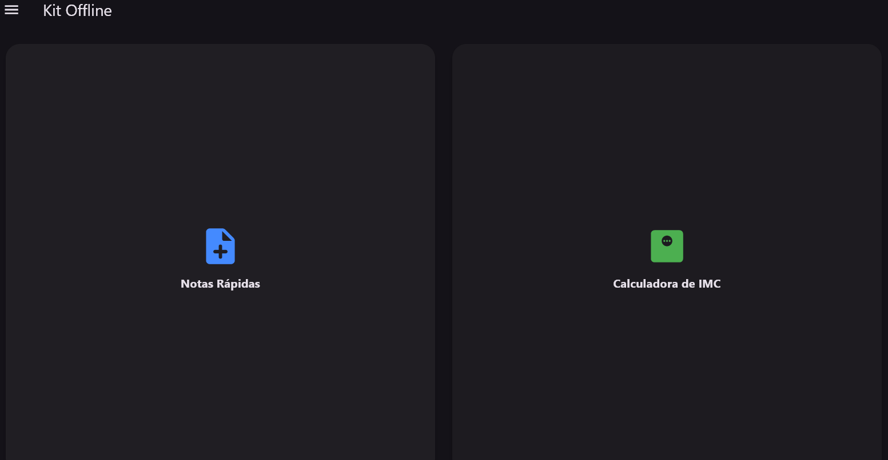
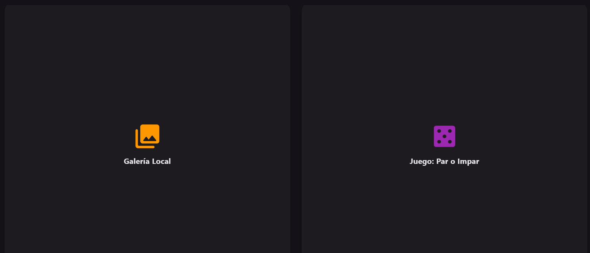
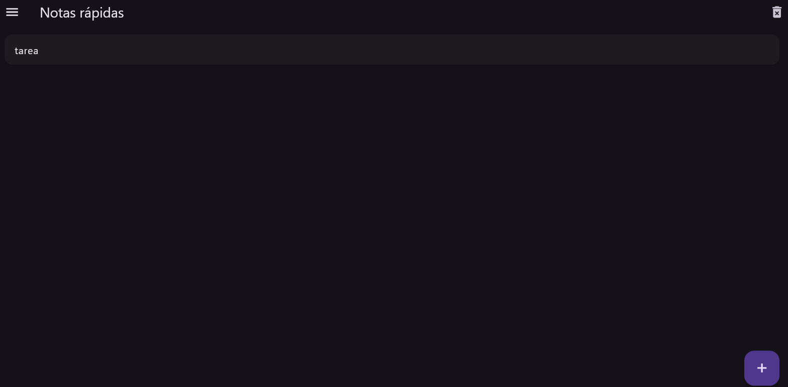
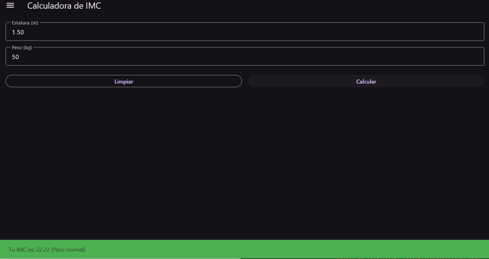
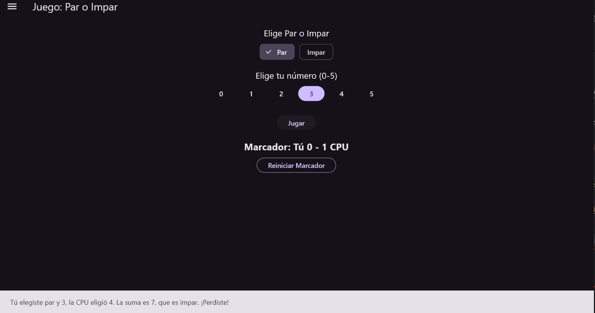
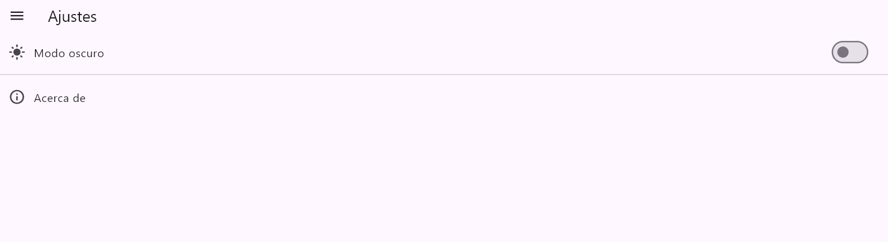

# flutter_application_1

## Descripción general

Es una aplicación móvil desarrollada con Flutter y dart que funciona como un aplicacion. El objetivo principal es mostrar diversas funcionalidades que se implementaron en este proyecto en un solo lugar para acceder a diferentes prácticas y módulos.

La aplicación está dividida en:

* Índice de Prácticas: Colección de prácticas realizadas anteriormente.
* Kit Offline: Mini-proyecto que contiene cuatro módulos funcionales.
* Ajustes: Una pantalla para personalizar la experiencia de usuario.

El proyecto demuestra habilidades en:
* Gestión de estados.
* Navegación entre pantallas.
* Uso de widgets comunes de Flutter.
* Manejo de recursos locales y paquetes de íconos.

---

## Cómo ejecutar

Para ejecutar este proyecto desarrollado en VS Code, sigue los siguientes pasos:

1.  Abre el proyecto en VS Code:
    Ir a `File` > `Open Folder` y selecciona la carpeta del proyecto de Flutter.

2.  Abre la terminal integrada:
    En VS Code, en el apartado de `Terminal` > `New Terminal` o las teclas `Ctrl + Shift + `. 

3.  Instalar las dependencias de Flutter:
    flutter pub get

4.  Asegurar que la carpeta de assets está configurada:
    Verifica que el archivo `pubspec.yaml` contenga la siguiente configuración bajo la sección `flutter:`.
    flutter:
      uses-material-design: true
      assets:
        - assets/imagenes/
    

5.  Ejecuta la aplicación:
    Con el emulador de un dispositivo, hay que presionar las teclas `CTRL + SHIFT + P` Y hacer clic en el botón `Run` en la esquina superior derecha de la ventana de VS Code.

---

## Capturas de la Aplicación

### Pantalla Principal (Hub)

### Índice de Prácticas

### Kit Offline
 

### Módulos del Kit Offline

#### Notas Rápidas

#### Calculadora de IMC

#### Juego: Par o Impar

### Kit Galeria

### Ajustes
